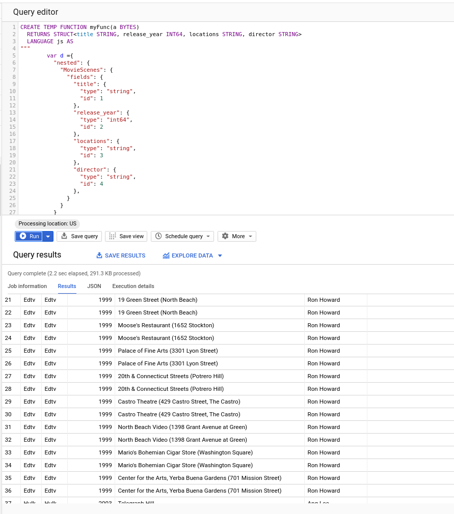

### BigQuery UDF Marshall/Unmarshall Protocolbuffers

Sample [BigQuery User-defined Function](https://cloud.google.com/bigquery/docs/reference/standard-sql/user-defined-functions) UDF that will encode and decode a [protocol buffer](https://developers.google.com/protocol-buffers/docs/proto3) using [protojs](https://github.com/protobufjs/protobuf.js).

This UDF allows you to specify the protobuf _inline_ as part of the UDF itself.  For example, you can dynamically specify the proto to encode against as a variable you pass to the actual exported function:


The following proto describes some fields that exists in the public BQ  `bigquery-public-data.san_francisco_film_locations.film_locations` dataset
```proto
syntax = "proto3";
message MovieScenes {
  string title = 1;
  int64  release_year = 2;
  string locations = 3;  
  string director = 4;  
}
```

So to extract those fiels into a proto, specify the JSON representation with types:

```javascript
        var d ={
          "nested": {
            "MovieScenes": {
              "fields": {
                "title": {
                  "type": "string",
                  "id": 1
                },
                "release_year": {
                  "type": "int64",
                  "id": 2
                },
                "locations": {
                  "type": "string",
                  "id": 3
                },  
                "director": {
                  "type": "string",
                  "id": 4
                },                                                  
              }
            }
          }
        }
        v = { title: name, release_year: yr, locations: loc, director: dir }    
        return protoSave(d,"MovieScenes",v);
```

### Usage

You can either build the UDF or use the one in this repo `prto_udf.js`

TO use the provided one, simply make a copy of it and place it into a GCS bucket in your project


### Build

To build, you will need nodejs and webpack the conversion utility that wraps `proto-js`

- Setup Webpack
```bash
mkdir webpack-demo
cd webpack-demo/
npm init -y
npm install --save protojs
npm install webpack webpack-cli --save-dev
npm install --save base64-arraybuffer protobufjs
```

- Create WebPack config and UDF functions

Create the following files with the content shown in the appendix
`webpack-demo/webpack.config.js` 
and
`webpack-demo/src/index.js`


- Generate webpack

```bash
npx webpack --config webpack.config.js 
```

This will generate the webpack at `webpack-demo/dist/main.js`


Edit `proto_udf.js` anc copy the contents of main.js into this file as shown below

```javascript

---> content of webpack-demo/dist/main.js <---

function protoSave(d,t,k) {
    c = protolib.ProtoSave(d,t,k);
    return c;
}
  
function protoLoad(d,t,k) {
    r= protolib.ProtoLoad(d,t,protolib.DecodeBuf(k));
    return r
}
```

Upload the file to a GCS bucket in your project

```bash
gsutil cp proto_udf.js gs://PROJECT_ID/
```

### Use

#### Encode

In the BigQuery console, run the following query to that will reference your UDF and encode some fields.  (remember) to modify the GCS URL (`library=["gs://$PROJECT_ID/proto_udf.js"]`)


```javascript
  CREATE TEMP FUNCTION myFunc(name STRING, yr INT64, loc STRING, dir STRING)
  RETURNS BYTES
  LANGUAGE js AS
"""  
        var d ={
          "nested": {
            "MovieScenes": {
              "fields": {
                "title": {
                  "type": "string",
                  "id": 1
                },
                "release_year": {
                  "type": "int64",
                  "id": 2
                },
                "locations": {
                  "type": "string",
                  "id": 3
                },  
                "director": {
                  "type": "string",
                  "id": 4
                },                                                  
              }
            }
          }
        }
        v = { title: name, release_year: yr, locations: loc, director: dir }    
        return protoSave(d,"MovieScenes",v);
"""    
OPTIONS (
  library=["gs://$PROJECT_ID/proto_udf.js"]
);

SELECT
  title, myFunc(title, release_year, locations, director)
FROM
  `bigquery-public-data.san_francisco_film_locations.film_locations`;
```

You should see the `title` column as well as `BYTES` representation of the `MovieScenes` protobuf


Now export the table so we can run a query against it.  In the example below, i exported the data to a dataset.table called `aead.pbencode`


#### Decode

To decode a protobuf, run the following query.  Remember to change GCS URL where the UDF is stored `library=["gs://mineral-minutia-820/proto_udf.js"]` as well as the dataset where you saved the encoded/bytes form of the protobuf

```javascript
CREATE TEMP FUNCTION myFunc(a BYTES)
  RETURNS STRUCT<title STRING, release_year INT64, locations STRING, director STRING>  
  LANGUAGE js AS
"""  
        var d ={
          "nested": {
            "MovieScenes": {
              "fields": {
                "title": {
                  "type": "string",
                  "id": 1
                },
                "release_year": {
                  "type": "int64",
                  "id": 2
                },
                "locations": {
                  "type": "string",
                  "id": 3
                },  
                "director": {
                  "type": "string",
                  "id": 4
                },                                                  
              }
            }
          }
        }

      return  protoLoad(d,"MovieScenes",a);
    
"""    
OPTIONS (
  library=["gs://PROJECT_ID/proto_udf.js"]
);

SELECT
  title, myFunc( f0_ )
FROM
  `PROJECT_ID.aead.pbencode`;
```

You should now see the decoded protobuf columns



---

### Appendix

- `webpack.config.js`
```javascript
const path = require('path');

module.exports = {
  entry: './src/index.js',
  mode: 'production',
  output: {
    filename: 'main.js',
    path: path.resolve(__dirname, 'dist'),
    library: 'protolib',
  },
};
```

- `webpack-demo/src/index.ts`

```typescript
var protobuf = require("protobufjs");

const {encode, decode} = require('base64-arraybuffer');

module.exports.ProtoSave = function (d,t,payload) {
    var root = protobuf.Root.fromJSON(d);
    var echoMessage = root.lookupType(String(t));
    var message = echoMessage.create(payload);
    var buffer = echoMessage.encode(message).finish();
    return encode(buffer)
}
  
module.exports.ProtoLoad = function (d,t,k) {
    var root = protobuf.Root.fromJSON(d);
    var echoMessage = root.lookupType(String(t));
    var message = echoMessage.decode(k);
    return message;
}

module.exports.DecodeBuf = function (d) {
    return new Uint8Array( decode(d) );
}
```
